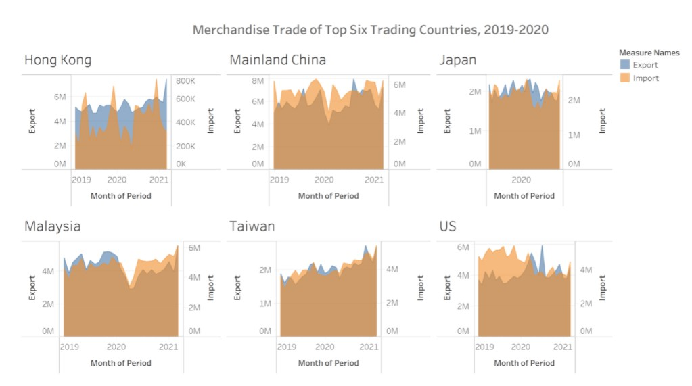
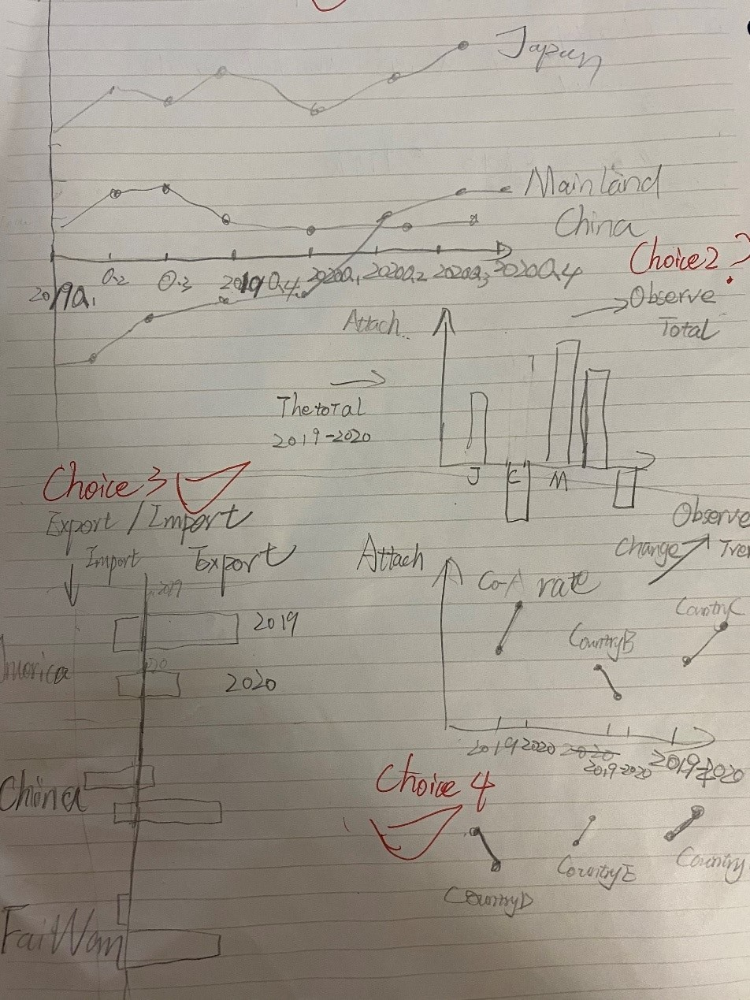

```{r setup, include=FALSE}
knitr::opts_chunk$set(echo = FALSE)
```

# 1.Original Visualization

This original data visualization comes from Department of Statistics, Singapore. It describes merchandise trade values among six trading countries in two aspects, import and export. This visualization has some problems that needs to be corrected and some details of that need to be improved.

Figure below shows the <font size="4" color="brown">Original Visualization</font>.


<font size="2" color="black">*Figure 1 Original Visualization*</font>

# 2.Critiques from Clarity and Aesthetic

### 2.1	Clarity

**1)	X-axis title represents wrong unit of period:** units of period are not unified in six charts and does not match chart title.

**2)	Y-axis data range is confusing:** data range and unit interval of Y-axis are not constant in two sides of chart (export and import), which makes data shown in charts are ambiguous and can not be compared obviously based on shape of charts.

**3)	Chart representing Japan merchandise trade lacks elements:** Chart representing Japan lacks unit of 2020.

**4)	Title of charts does not express precisely:** This chart title mentions about merchandise trade but do not clearly state which measure should be used（Export/Import/Merchandise Balance. These six countries are also not top 6 trading countries based on data source.

### 2.2	Aesthetic
**1)	Axis Orientation are lacked.**

**2)	Color of charts do not have any emphasis:** Color choice in this chart is useless, two color representing in this chart are all light, which do not capture emphasis and are useless to express observation.

**3)	Poor Chart choice without expressing focus:** This visualization use six graphs to outline six countries merchandise trade situations. It is not the most appropriate choice-combining them to one graph to see difference and compare.

**4)	Import and Export data visualization have some overlap that cant see the details:** Color overlap and shading in this chart will affect observation of details in datasheet. Readers will be hard to observe detailed data.

**5)	Font Size of Title is too small:** Font size of title is not obvious and the title does not have any bold adjustment.

**6)	Few figure annotations are added in charts:** This chart are lacked of grid line, label number to clarify data.

**7)	All the charts are the same size:** the size of charts which are the same, are not good to let readers focus, it is better to have one chart to be the main one, others are to illustrate.


# 3.Proposed Design

### 3.1	Sketch

{ width=60% }

<font size="2" color="black">*Figure 2 Sketch*</font>

### 3.2	Clarity Improvement

1)	Instead of using six graphs representing six countries which express ambiguous focus, use three charts that separately represents Trend of merchandise trade balance change, Import & Export and Total amount of merchandise trade to emphasize my observation.
2)	Only selected figures (2019-2020) among six countries are chosen to shown consistently.
3)	All unit intervals are consistent to express real scenarios.
4)	Main titles of chart will express precisely to show big picture and sub title will express observations that I want to express. 

### 3.3	Aesthetic Improvement

1)	Three different design of charts will not lead to aesthetic fatigue, and will be more focus on express of observation.
2)	Font Size of title and color of graphs will be adjusted appropriately to express important observations.
3)	Grid lines will be added to separate different countries.
4)	Figure annotation will be added in the charts to emphasize.
5)	Decrease the overlap of import and export chart.
6)	The size of chart will be adjusted and they are not the same, One chart is a big picture, other charts are made to illustrate.

# 4.Steps of Data Visualization

### 4.1	Data Preparation

For data preparation, the data source is downloaded from [<font size="3"  color="blue">*Statistics Singapore*</font>](https://www.singstat.gov.sg/find-data/search-by-theme/trade-and-investment/merchandise-trade/latest-data) and Excel and Tableau are implemented to do data preparation for our visualization.

<font size="3" color="black">	1)Remove unnecessary columns and Filter</font>


Hide Rows which do not present data from 2019-2020, and select countries that are from six trading countries and districts (Hong Kong, Taiwan, Mainland China, US, Malaysia and Japan)

{ width=60% }

<font size="2" color="black">*Figure 3 Origin Table*</font>

<font size="3" color="black">2)	Create and Transform Sheets</font>

Create three sheets which name Export, Import and Merchandise Trade separately. Since 1-D sheet will be more suitable for Tableau to implement and use, these three tables are transformed from 2-D to 1-D format by Excel.

{ width=60% }

<font size="2" color="black">*Figure 4 1_D Table*</font>

<font size="3" color="black"> 3)	Fix Data Problems </font>

Some Countries data are valued by million, some are valued by thousand.
All data are transformed to measure in thousands.

<font size="3" color="black"> 4)	Export Data to Tableau </font>
Save and rename file as DataViz.

<font size="3" color="black"> 5)	Build Relationships </font>

{ width=60% }

<font size="2" color="black">*Figure 5 Relationship*</font>

<font size="3" color="black"> 6)	Change Data Type </font>

Transform Date data type from String to Date . 

{ width=30% }

<font size="2" color="black">*Figure 6 Change Data Type* </font>

### 4.2	Data Visualisation

<font size="3" color="black"> 1)	**Worksheet 1: Merchandise Trade Balance by Six Countries (2019Q1-2020Q4) **</font>

To measure merchandise data change, use Quarter measure. Drag Date to Columns and Drag Merchandise Value to Rows, adjust Date to Quarter Measure. Apply Country to Color to separate six countries. Adjust Size to line chart to make lines more obvious.

{ width=30% }

<font size="2" color="black">*Figure 7 Line Size*</font>


The final edition of worksheet1 shows as follows:


{ width=100% }

<font size="2" color="black">*Figure 8 Worksheet1*</font>

<font size="3" color="black"> 2)	**Worksheet 2: Merchandise Trade Trend by Six Countries (2019-2020) **</font>

To have a big picture of Merchandise trade type among six countries and know their yearly change rate.
Drag Merchandise value to Rows and Country, Merchandise value to columns, change Merchandise column to discrete data type, measure(sum), and apply color to country and Year(Date) to Label.

{ width=20% }

<font size="2" color="black">*Figure 9 Change Data Type*</font>


Add Reference line and Rename this worksheet.


{ width=60% }

<font size="2" color="black">*Figure 10 Reference Line Setting*</font>

The final edition of worksheet2 shows as follows:

{ width=100% }

<font size="2" color="black">*Figure 11 Worksheet2*</font>


<font size="3" color="black"> 3)	**Worksheet 3: Import-Export Value by Six Countries **</font>

Not only to know the Merchandise data, but also to understand export value and import value among six countries from 2019-2020, Create Worksheet 3 to modify.
Drag Import Value and Export Value to Columns and drag Country and Time to Rows. Apply Measure Name to Color and Time to Label.
To make the axis range same and contrast import and export, right click axis, and click Edit Axis. And then unify fixed value (0-90000000) in export and import value.

{ width=30% }

<font size="2" color="black">*Figure 12 Edit Axis *</font>


Edit Title to highlight Export and Import difference and change color to blue and red separately.


{ width=30% }

<font size="2" color="black">*Figure 13 Edit Title*</font>


The final edition of worksheet3 shows as follows:


{ width=100% }

<font size="2" color="black">*Figure 14 Worksheet3*</font>

# 5.Final Visualisation

### 5.1 Dashboard

Combine worksheet1 and worksheet 2 and worksheet3 together and allocate their locations in the dashboard.

{ width=100% }
<font size="2" color="black">*Figure 15 Dashboard *</font>

### 5.2	Observation

1)From 2019-2020, Only China and Hong Kong have positive merchandise trade balance, which can be regarded as Export Countries, America has negative merchandise trade value in 2019 but its exports outweigh imports in 2020. Other countries have negative merchandise trade value in both two years.

2)From 2019 to 2020, Japan has the most stable growth rate, which is nearly 5%, followed by Taiwan. Malaysia experience most drastic change of merchandise trade balance in these two years.

3)Mainland China has both the highest import value and highest export value compared with other countries and districts . Hong Kong has the lowest income values compared with those of other countries and districts.

4) Only Malaysia and Taiwan experienced decline in merchandise trade value from 2019-2020, other countries grows well merchandise trade in these two years.

5) From 2019 to 2020, America performs very well in growth rate of merchandise trade, while Malaysia performs the worst.

