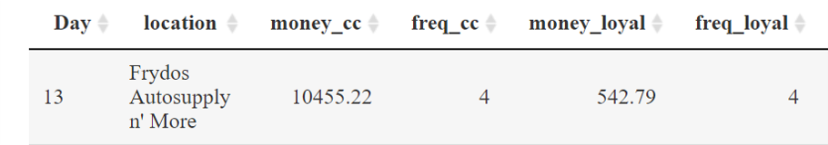

## 1.Data Preparation

### 1.1 Global Settings

The global settings of R code chunks in this post is set as follows. 

```{r setup, include=FALSE}
options(htmltools.dir.version = FALSE)
knitr::opts_chunk$set(fig.retina = 3,
                      echo = TRUE,
                      eval = TRUE,
                      message = FALSE,
                      warning = FALSE)

```

### 1.2 R Packages Installation

The following code input is to prepare for R Packages Installation.

```{r}
# !diagnostics off
packages = c('raster','sf','tmap', 'clock','DT', 'ggiraph', 'plotly', 'tidyverse','dplyr','readr','hrbrthemes','tmap','mapview')
for(p in packages){
  if(!require(p, character.only = T)){
    install.packages(p)
  }
  library(p, character.only = T)
}

```

### 1.3 Data Import
The following code is to import raw data sets from [<font size="3"  color="blue">*Mini Challenge2*</font>](https://vast-challenge.github.io/2021/MC2.html)("*car-assignment.csv*","*cc_data.csv*","*gps.csv*","*loyalty_data.csv*").

```{r}
credit_debit <- read_csv("data/cc_data.csv")
loyalty_data <- read_csv("data/loyalty_data.csv")
car_assignment <- read_csv("data/car_assignments.csv")
GPS <- read_csv("data/gps.csv")

```
## 2.Tasks and Questions for Mini-Challenge2

### 2.1 Q1 Intruoduction

Using just the credit and loyalty card data, identify the most popular locations, and when they are popular. What anomalies do you see? What corrections would you recommend to correct these anomalies?


#### 2.1.1 Data Preparation for Q1


**Comparison of total amount between credit/debit card and loyalty card**


To know which place is most populated and when it is populated, we need a data table to list the most populated places and its time.

```{r}
# !diagnostics off
loyalty_data$count_event=1
credit_debit$count_event=1

aggregate_dataset <- loyalty_data %>% 
    group_by(timestamp,location) %>% 
    dplyr::summarize(Frequency = sum(count_event),Money_loyalty=sum(price))


credit_debit$timestamp <- strptime(credit_debit$timestamp, "%m/%d/%Y %H:%M")
aggregate_cc <- credit_debit %>% 
    group_by(timestamp,location) %>% 
    dplyr::summarize(Frequency = sum(count_event),Money_cd=sum(price))


```

**Adjustment of Date Type and create a new column named "Day"**

```{r}
aggregate_dataset$timestamp <- as.Date(aggregate_dataset$timestamp, "%m/%d/%Y")

aggregate_dataset$Day <- format(aggregate_dataset$timestamp, format="%d")
aggregate_cc$Day <- format(aggregate_cc$timestamp, format="%d")
```

**Aggregation of loyalty cost and credit_debit cost**

```{r}
loyalty_money <- aggregate_dataset %>% group_by(Day,location) %>% dplyr::summarise(money_loyal=sum(Money_loyalty),freq_loyal=sum(Frequency))

cc_money <- aggregate_cc %>% group_by(Day,location) %>% dplyr::summarise(money_cc = sum(Money_cd),freq_cc=sum(Frequency))
```

**Table 2.1**Combination of loyalty_money and cc_money

```{r}


Comparison <- full_join(cc_money, loyalty_money, by = c('Day','location'))
Comparison[is.na(Comparison)] <- 0
Comparison$Money_dif=Comparison$money_cc-Comparison$money_loyal
Comparison$Freq_dif=Comparison$freq_cc-Comparison$freq_loyal

Comparison<-Comparison%>%
arrange(freq_cc)

datatable(Comparison,rownames = FALSE)


```
During data exploration, we can see there are five records that don't have any cost in credit card and debit card,but there are consumption records in loyalty card.

**Table 2.2**Combination of loyalty_money and cc_money

```{r}


Result1 <- Comparison  %>%
dplyr::group_by(Day) %>%
filter(freq_cc == max(freq_cc)) %>%
arrange(desc(Day))

datatable(Result1,rownames = FALSE)


```
From the new data frame "Result1", Now we can see that Katerina's Cafe is the most popular place based on data records from Day 6 to Day 19,which appears 6 times in 14 days records.

To find out more anomalies from the data, we need more obvious data visualization.

#### 2.1.2 Data Visualization

**new column: text for tooltip**

```{r}

Comparison$Money_dif <- round(Comparison$Money_dif ,2)

Comparison <- Comparison %>%
  mutate(text = paste0("Location: ", location, "\n", "Day of January: ", Day, "\n", "Money Difference: ",Money_dif))


Comparison <- Comparison%>%
  mutate(text2 = paste0("Location: ", location, "\n", "Day of January: ", Day, "\n", "Frequency Difference: ",Freq_dif))
```


**Heat map of money difference**

```{r,fig.height=8,fig.width=10}
p <- ggplot(data = Comparison, aes(x=Day, y=location,fill=Money_dif,text=text)) + 
  geom_tile() +
  geom_text(aes(label = Money_dif)) +
  scale_fill_gradient(low="pink", high="blue") +
  theme_ipsum()

p <- p + theme(axis.text.y = element_text(size = 8))

ggplotly(p, tooltip="text")
```
<font size="2" color="black">*Figure 1 Money difference*</font>


**Figure:Heat map of frequency difference**

```{r,fig.height=6,fig.width=10}
z <- ggplot(data = Comparison, aes(x=Day, y=location,fill=Freq_dif,text=text2)) + 
  geom_tile() +
  scale_fill_gradient(low="light yellow", high="red") +
  geom_text(aes(label = Freq_dif))+
  theme_ipsum()

z <- z + theme(axis.text.y = element_text(size = 8))

ggplotly(z, tooltip="text2")
```
<font size="2" color="black">*Figure 2 Frequency difference*</font>


#### 2.1.3 Infer and Analysis
we can see more anomalies comparing these two heat maps:
1.In these two weeks,except Maximum Iron and steel which the differences in money and frequencies are both 0, other places in these two weeks all appear difference in some days either in frequency or money.

2.In Frydos Auto Supply on Day 13, it has a large cost consumption of 9912.43 but the heat map of frequency difference shows 0 in frequency difference. Through DT function to trace back the raw data, we can find that loyalty card shows total consumption is 542.79,and credit and debit cards show money spent is 10455.22,but both their number of consumption record is the same. It is quite strange.

3.Another anomaly is from data table 4.1, there are five records showing that credit card and debit card consumption cost are 0, but loyalty card has consumption records .And among these 5 records, the most doubtful part is that Stewart and Sons Fabrication in Day 13 has 4071.95 cost,which is also needed to be noted.


### 2.2 Q2 Intruoduction
Add the vehicle data to your analysis of the credit and loyalty card data. How does your assessment of the anomalies in question 1 change based on this new data? What discrepancies between vehicle, credit, and loyalty card data do you find? Please limit your answer to 8 images and 500 words.

#### 2.2.1 Data Preparation for Q2
To proceed in the Q2, we decide to have data manipulation for another two datasets GPS and car_Assignment.

**Data Manipulation for car_Assignment data set and gps data**

```{r}
#Make up the full name
car_assignment1 <-car_assignment %>% unite("Full Name", LastName:FirstName, remove = FALSE)
car_assignment1 <- subset(car_assignment1, select = -c(LastName,FirstName) )
car_assignment1$CarID <- as_factor(car_assignment1$CarID)
```


```{r}
#Basic settings for GPS
#Create (longitude,latitude format)
GPS$Timestamp <- strptime(GPS$Timestamp, "%m/%d/%Y %H:%M:%S")
GPS$day <- as.factor(get_day(GPS$Timestamp))
GPS$id <- as_factor(GPS$id)


GPS_sf <- st_as_sf(GPS, 
                   coords = c("long", "lat"),
                       crs= 4326)#Create (longitude,latitude) for GPS

#Create gps path
gps_path <- GPS_sf %>%
  group_by(id,day) %>%
  summarize(m = mean(Timestamp), 
            do_union=FALSE) %>%
  st_cast("LINESTRING")


#Delete Orphan route
p = npts(gps_path, by_feature = TRUE)
gps_path2 <- cbind(gps_path, p)
gps_path2 <- dplyr::filter(gps_path2,p!=1)


```

```{r}
#create time delta between points
GPS_sf1<-GPS_sf %>%
  dplyr::arrange(day, Timestamp) %>%
  group_by(id,day) %>%
  mutate(diff = Timestamp - lag(Timestamp),
         diff_mins = as.numeric(diff, units = 'mins'))
#Round to the hundredth place and fill NA
GPS_sf1$diff_mins <- round(GPS_sf1$diff_mins,2)

GPS_sf1 <- GPS_sf1 %>%
  mutate_at(vars(diff_mins), ~replace_na(., 0))

GPS_sf1 <- subset(GPS_sf1, select = -c(diff) )
#Set up Stopping points based on assumption
GPS_sf1$Parking_point<-0
GPS_sf1$Parking_point[GPS_sf1$diff_mins>=5]<-1
GPS_sf1$Parking_point[GPS_sf1$diff_mins<5]<-0
```

```{r}
#GPS_sf1 left join Car_assignment1
GPS_ID <-left_join(GPS_sf1, car_assignment1, by = c("id"="CarID"))

```


```{r}
bgmap <- raster("Data/MC2-tourist.tif")

Abila_st <- st_read(dsn = "Data/Geospatial",
                    layer = "Abila")
tm_shape(bgmap) +
tm_rgb(bgmap, r = 1,g = 2,b = 3,
       alpha = NA,
       saturation = 1,
       interpolate = TRUE,
       max.value = 255)

```


```{r}


#filter out those points where person stay for more than 5 minutes.
GPS_filter <- GPS_ID %>%
  filter(Parking_point > 0)

#filter out 
GPS_filter$stayperiod<-"Short(0~6)"
GPS_filter$stayperiod[GPS_filter$diff_mins>=360]<-"Long(6+)"
GPS_filter$stayperiod[GPS_filter$diff_mins<360]<-"Short(0~6)"

GPS_home <- GPS_filter %>%
  filter(stayperiod=="Long(6+)")

GPS_park <- GPS_filter %>%
  filter(stayperiod=="Short(0~6)")

# plot scatter graph in map to find short-time parking locations in the map
tmap_mode("view")
tm_shape(bgmap) + 
  tm_rgb(bgmap, r = 1,g = 2,b = 3,
       alpha = NA,
       saturation = 1,
       interpolate = TRUE,
       max.value = 255) +
  tm_shape(GPS_park) +
  tm_dots(col="black")+

# plot scatter graph in map to find long-time parking locations in the map
tmap_mode("view")
tm_shape(bgmap) + 
  tm_rgb(bgmap, r = 1,g = 2,b = 3,
       alpha = NA,
       saturation = 1,
       interpolate = TRUE,
       max.value = 255) +
  tm_shape(GPS_home) +
  tm_dots(col="red",size=0.08)
```


From Q1, we noticed that Day 13 has a large amount of money difference that reaches 9912.43 in the Fry dos Auto Supply, we want to notice who park their car in Frydos Auto Supply that is possible to buy a vehicle,we create a route map to show that cars whose  ID are 12,13,15,16,20,34 parsed through this place,these car drivers have suspicious.


```{r}
gps_path_selected <- gps_path2 %>%
  group_by(id,day)%>%
  filter(day==13
         )
tmap_mode("view")
tm_shape(bgmap) + 
  tm_rgb(bgmap, r = 1,g = 2,b = 3,
       alpha = NA,
       saturation = 1,
       interpolate = TRUE,
       max.value = 255) +
  tm_shape(gps_path_selected) +
  tm_lines()
```

Q3 Can you infer the owners of each credit card and loyalty card? What is your evidence? Where are there uncertainties in your method? Where are there uncertainties in the data? Please limit your answer to 8 images and 500 words.

**Answer**: To answer Q3's question, we need to build a relationship between credit card & loyalty card owner and car owner. So this relationship connection is based on parking car site and location in the map. We need to find a logical time gap that can be the proof to help real location site to match parking car site.

So first of all, restructure GPS data set to create minute gap and build a box plot to find the appropriate time gap for parking car.

```{r}
GPS_track <- GPS_sf %>%
  dplyr::arrange(day, Timestamp) %>%
  group_by(id,day) %>%
  mutate(diff = Timestamp - lag(Timestamp),
         diff_mins = as.numeric(diff, units = 'mins'))


```


```{r}
GPS_track$diff_mins <- round(GPS_track$diff_mins,2)
GPS_track <- GPS_track %>%
  mutate_at(vars(diff_mins), ~replace_na(., 0))

GPS_track$hour<- format(GPS_track$Timestamp, format="%H")
```


Now we want to justify which time gap is suitable for a parking time period, we build up a box plot based on dif_mins column.

```{r}
boxplot1=ggplot(GPS_track,aes(x="",y=GPS_track$diff_mins))+geom_boxplot()+labs(title="Distribution of time gap")+theme_classic()


ggplotly(boxplot1)

```
Since the boxplot shows that more than 3/4 data points of dif_mins column are 0, it is useless for us to have a justification for parking time,but we also find one car's movement is unusual and its time gap is 1058.27min. So we can only assume that data points whose dif_mins >5 are recognized as parking point. Based on this assumption, we build up a new column called parking point.

```{r}

GPS_track$point <- 0
GPS_track$point[GPS_track$diff_mins >5 ] <- 1
GPS_track$point[GPS_track$diff_mins <=5 ] <- 0


```

```{r}
glimpse(GPS_track)
```
*Aggregate the points so that we can know one car driver in one day park its car in how many places?*


```{r}
Tracker_GPS <- aggregate(GPS_track$point, by=list(id=GPS_track$id,day=GPS_track$day,hour=GPS_track$hour), FUN=sum)

```


```{r}
glimpse(Tracker_GPS)
glimpse(car_assign2)
```
Build a data table named Car_owner to combine info of employee and car driver.

```{r}
car_assign2$CarID <- as_factor(car_assign2$CarID)
Car_owner <- full_join(Tracker_GPS,car_assign2,  by = c("id" ="CarID"))

```

```{r}
glimpse(loyalty_data)

credit_debit$hour<- format(credit_debit$timestamp, format="%H")

glimpse(credit_debit)
```


```{r}


loyalty_data$timestamp <- as.Date(loyalty_data$timestamp, "%m/%d/%Y")

loyalty_data$day <- as.factor(get_day(loyalty_data$timestamp))
loyalty_data$loyaltynum <- as.factor(loyalty_data$loyaltynum)
```

```{r}
loyalty_people <- 
aggregate(loyalty_data$count_event, by=list(loyalnum=loyalty_data$loyaltynum,day=loyalty_data$day), FUN=sum)

loyalty_people$loyalnum <- as_factor(loyalty_people$loyalnum)

```

```{r}

credit_debit$last4ccnum <- as.factor(credit_debit$last4ccnum)

```


```{r}

credit_debit$day <- as.factor(get_day(credit_debit$timestamp))


cd_people <- 
aggregate(credit_debit$count_event, by=list(last4cnum=credit_debit$last4ccnum,day=credit_debit$day,hour=credit_debit$hour), FUN=sum)

cd_people$last4cnum <- as_factor(cd_people$last4cnum)

```

```{r}
glimpse(cd_people)
glimpse(loyalty_people)


```


```{r}


car_cl<-inner_join(cd_people,Car_owner,by=c("day","x","hour"))


```


Q5. Do you see evidence of suspicious activity? Identify1- 10 locations where you believe the suspicious activity is
occurring,and why Please limit your response to 10 images and 500 words.


*First suspicious activity * 
Day 13 has a large amount of money difference that reaches 9912.43 in the Fry dos Auto Supply,although the number of cost records are the same(4).

{ width=60% }

*Second suspicious activity * 
